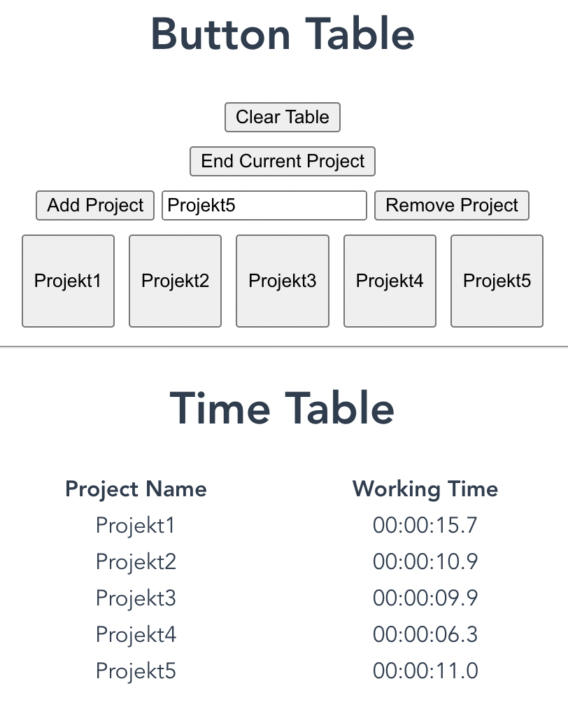

# TimeTracker

- Try it: [time-tracker](https://lukasmetzner.github.io/time-tracker/)

## TODOs
- [ ] Clean up code
- [ ] Make actual components out of HelloWorld.vue

## Overview

- Track how much time you spend per project in a single day
- Hit a project button to start a project and stop the previous one
- Table and Buttons are stored in localStorage
- localStorage of the table can be cleared with Clear Table
- Add new projects to button list
- Remove projects from button list



### Subtree stuff
```
git subtree push --prefix dist origin gh-pages
```
